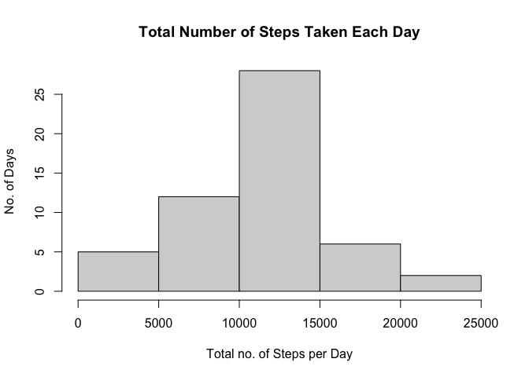
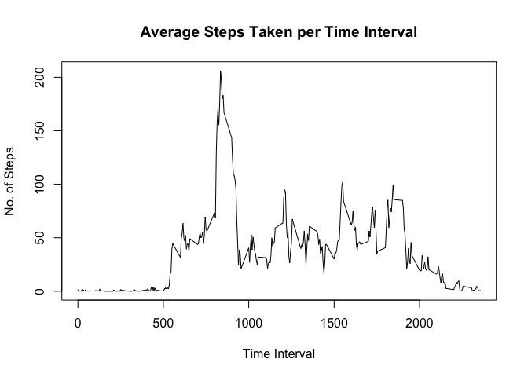
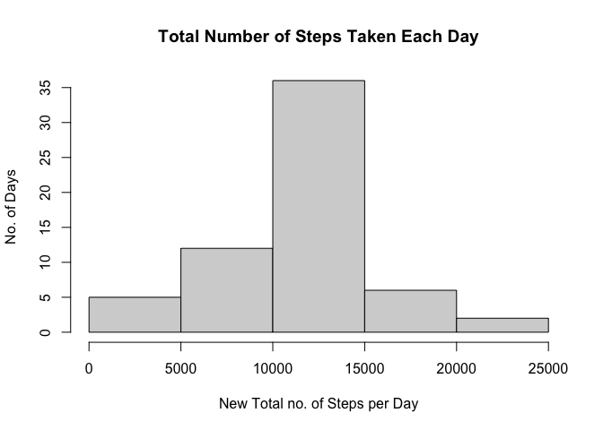
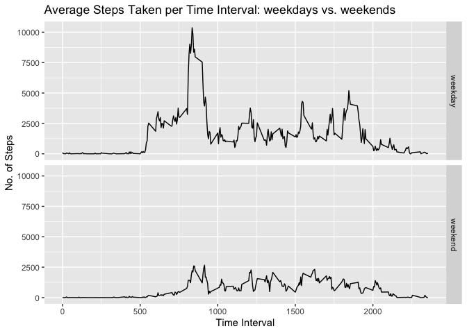

## Loading and preprocessing the data
Unzip the file and load the data.

```r
unzip("./activity.zip")
ActivityData <- read.csv("./activity.csv")
```
Check the variable types.

```r
str(ActivityData)
```

```
## 'data.frame':	17568 obs. of  3 variables:
##  $ steps   : int  NA NA NA NA NA NA NA NA NA NA ...
##  $ date    : chr  "2012-10-01" "2012-10-01" "2012-10-01" "2012-10-01" ...
##  $ interval: int  0 5 10 15 20 25 30 35 40 45 ...
```
The date is stored as a character variable. Convert this to a date variable.

```r
ActivityData$date <- as.Date(ActivityData$date,format="%Y-%m-%d")
```
Check the date is stored as a date variable.

```r
str(ActivityData)
```

```
## 'data.frame':	17568 obs. of  3 variables:
##  $ steps   : int  NA NA NA NA NA NA NA NA NA NA ...
##  $ date    : Date, format: "2012-10-01" "2012-10-01" ...
##  $ interval: int  0 5 10 15 20 25 30 35 40 45 ...
```

## What is mean total number of steps taken per day?
Calculate the total number of steps taken per day.

```r
StepsPerDay <- aggregate(steps~date,ActivityData,sum,na.rm=TRUE)
```
Plot a histogram of the total number of steps taken each day.

```r
hist(StepsPerDay$steps,xlab="Total no. of Steps per Day", ylab="No. of Days",
     main="Total Number of Steps Taken Each Day")
```

<!-- -->
Calculate the mean and median total number of steps taken each day.

```r
SPDmean <- as.integer(mean(StepsPerDay$steps,na.rm=TRUE))
SPDmedian <- as.integer(median(StepsPerDay$steps,na.rm=TRUE))
```
The mean total number of steps taken each day is 10766 and the median is 
10765.

## What is the average daily activity pattern?
Calculate the mean number of steps taken per time interval.

```r
StepsPerInterval <- aggregate(steps~interval,ActivityData,mean,na.rm=TRUE)
```
Plot a time series of the average number of steps taken per time interval,
 averaged across all days.

```r
 with(StepsPerInterval,plot(interval,steps,type="l",ylab="No. of Steps",
      xlab="Time Interval", main="Average Steps Taken per Time Interval"))
```

<!-- -->
Find the time interval, on average across all the days in the dataset, that 
contains the maximum number of steps.

```r
MaxStepsInterval <- StepsPerInterval[which.max(StepsPerInterval$steps),1]
```
On average, across all the days in the dataset, interval 835 
contains the maximum number of steps.

## Imputing missing values
Calculate the total number of missing values.

```r
missingValues <- is.na(ActivityData$steps)
```
There are 2304 missing values in the dataset.
Create a new dataset and use the mean steps per interval to fill in the missing 
values for that interval from the original dataset.

```r
NewActivityData <- ActivityData
NewActivityData$steps<-ifelse(is.na(NewActivityData$steps),
  round(StepsPerInterval$steps[match(NewActivityData$interval, 
  StepsPerInterval$interval)],0), NewActivityData$steps)
```
Check there are no more missing values.

```r
sum(is.na(NewActivityData$steps))
```

```
## [1] 0
```
Calculate the new total number of steps taken per day.

```r
NewStepsPerDay <- aggregate(steps~date,NewActivityData,sum,na.rm=TRUE)
```
Plot a histogram of the new total number of steps taken each day.

```r
hist(NewStepsPerDay$steps,xlab="New Total no. of Steps per Day", ylab="No. of Days",
     main="Total Number of Steps Taken Each Day")
```

<!-- -->
Calculate the new mean and median total number of steps taken each day.

```r
NewSPDmean <- as.integer(mean(NewStepsPerDay$steps,na.rm=TRUE))
NewSPDmedian <- as.integer(median(NewStepsPerDay$steps,na.rm=TRUE))
```
The new mean total number of steps taken each day is 10765 and the new 
median is 10762.   
These values differ from when there were missing values in the dataset. Both 
values have decreased, the mean by 1 step and the median by 3 steps.

## Are there differences in activity patterns between weekdays and weekends?
Create a new factor variable in the dataset with two levels – “weekday” and “weekend” indicating whether a given date is a weekday or weekend day.

```r
NewActivityData$day <- weekdays(NewActivityData$date)
NewActivityData$dayType <- factor(ifelse(NewActivityData$day=='Saturday' | 
                        NewActivityData$day=='Sunday', 'weekend','weekday'))
```
Calculate the total number of steps taken per day type (weekday/weekend).

```r
StepsPerIntDayType <- aggregate(steps~interval+dayType,NewActivityData,sum,na.rm=TRUE)
```
Create a panel plot containing a time series plot of the 5-minute intervaland 
the average number of steps taken, averaged across all weekday days or weekend days

```r
library(ggplot2)
j <- ggplot(StepsPerIntDayType, aes(interval, steps))
j+geom_line()+ggtitle("Average Steps Taken per Time Interval: weekdays vs. weekends")+xlab("Time Interval")+ylab("No. of Steps")+facet_grid(dayType ~ .)
```

<!-- -->
